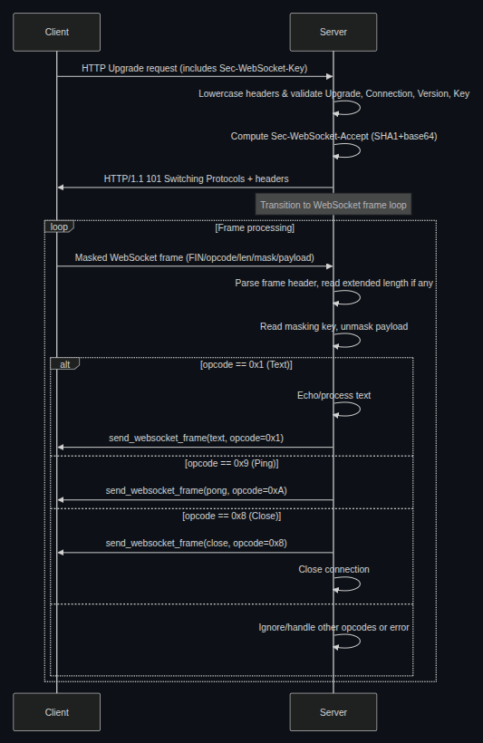
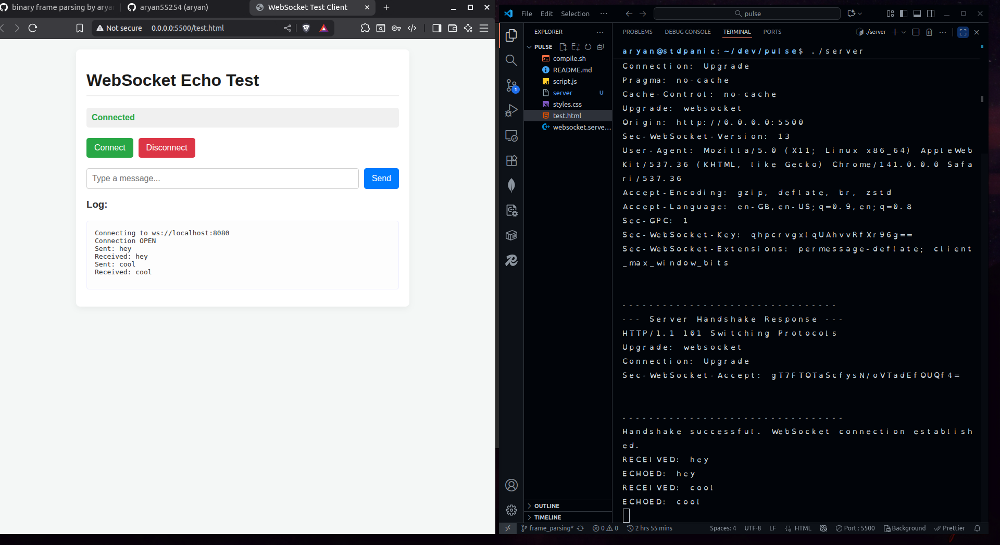

# Pulse: C++ WebSocket Echo Server From Scratch

A complete WebSocket echo server built from scratch in C++ using low-level POSIX sockets and OpenSSL.

## Overview
- Implements full WebSocket protocol (RFC 6455)
- Handles HTTP/1.1 upgrade handshake
- Custom binary frame-parsing logic
- Uses POSIX sockets and OpenSSL crypto

## Architecture & Demo
### Architecture Diagram


### Demo Screenshot


## Setup Guide

### 1. Dependencies
Required packages:
- g++
- OpenSSL development library

Install on Ubuntu/Debian:
```bash
sudo apt-get install g++ libssl-dev
```

### 2. Compilation
Make the compile script executable:
```bash
chmod +x compile.sh
```

Build the server:
```bash
./compile.sh
```

### 3. Running
Start the server:
```bash
./server
```
You should see: `Server listening on port 8080...`

### 4. Testing
1. Open `test.html` in a modern web browser
2. Click "Connect"
3. Type a message and click "Send"
4. The server will echo back your message
